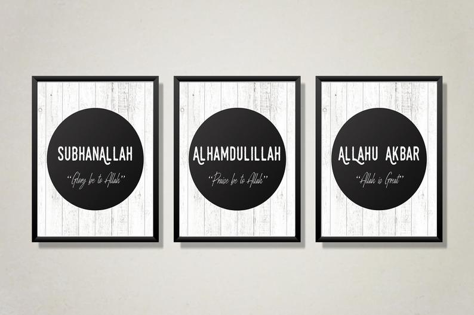

<h4>Click, and accumulate the three dhikr praises throughout the day!</h4>

The Messenger of Allah (ﷺ) said, “He who recites after every prayer: Subhan-Allah (Allah is free from imperfection) thirty-three times; Al-hamdu lillah (praise be to Allah) thirty-three times; Allahu Akbar (Allah is Greatest) thirty-three times; and completes the hundred with: La ilaha illallahu, wahdahu la sharika lahu, lahul-mulku wa lahul-hamdu, wa Huwa ‘ala kulli shai’in Qadir (there is no true god except Allah. He is One and He has no partner with Him. His is the sovereignty and His is the praise, and He is Omnipotent), will have all his sins pardoned even if they may be as large as the foam on the surface of the sea.”

[Muslim].
 Reference: Book 16, Hadith 12

<h4>About the project</h4>

This simple project deomonstartes an onClick event with a created handleChange method that accumulates the count.
A state is used for the count.
For once, proud to say I did this from scratch, Alhumdullilah!
